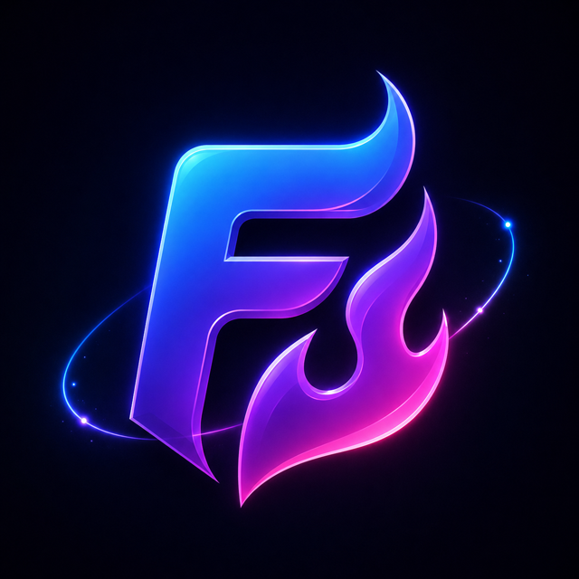

# FancyBlazor

[](https://github.com/Syntax-Circus/SyntaxCircus.FancyBlazor/actions/workflows/build.yml)
[](https://www.nuget.org/packages/SyntaxCircus.FancyBlazor)
[](https://www.nuget.org/packages/SyntaxCircus.FancyBlazor.WebGL)
[](https://www.nuget.org/packages/SyntaxCircus.FancyBlazor.UI)
[](LICENSE)

<p align="center">
  
</p>

**Live demo:** [Explore the FancyBlazor catalog](https://fancyblazor-demo-latest.onrender.com)

**Roadmap:** [See the approved pre-1.0 expansion phases](docs/architecture/99-IMPLEMENTATION-ROADMAP.md)

Composable visual effects for Blazor: backgrounds, borders, viewport reveals,
pointer motion, parallax, and shimmer—without React islands, a runtime CDN, or
consumer JavaScript tooling.

FancyBlazor targets `net10.0` and works with static SSR, Interactive Server,
Interactive WebAssembly, Interactive Auto, and standalone WebAssembly. It is
CSS-framework-agnostic and keeps meaningful child content as ordinary semantic DOM.

> **Preview software.** The API may change before 1.0. Published as-is and
> maintained on a best-effort basis; there is no support SLA.

## Install and register

```bash
dotnet add package SyntaxCircus.FancyBlazor
```

Register the shared runtime in every executable host. Interactive Auto apps
register it in both server and client `Program.cs` files.

```csharp
using SyntaxCircus.FancyBlazor;

builder.Services.AddFancyBlazor();
```

Import the root namespace in `_Imports.razor`:

```razor
@using SyntaxCircus.FancyBlazor
```

No script tag, npm package, CDN, or manual stylesheet import is required.

## First effect

```razor
<ShaderBackground Effect="ShaderEffect.Nacre"
                  Palette="FancyPalettes.Witchlight">
    <section class="hero">
        <h1>Build something that catches light.</h1>
        <p>This remains semantic HTML before and after WebGL initializes.</p>
    </section>
</ShaderBackground>
```

Before interactivity—or when WebGL is unavailable—the component displays a
palette-derived CSS background and leaves the content usable.

## Kinetic text

`WordRotate`, `MorphText`, and `Typewriter` cycle, crossfade, or progressively
type decorative text while keeping the visible motion `aria-hidden` and
exposing a complete accessible mirror to assistive technology. They all share
the same lifecycle as the other JS-light effects and respect
`prefers-reduced-motion`.

```razor
<WordRotate Words="@(new[] { "Compose", "Animate", "Ship" })" Interval="TimeSpan.FromSeconds(1.5)" />
<MorphText Words="@(new[] { "Frosted", "Faceted", "Filament" })" Mode="MorphMode.CharSplit" />
<Typewriter Text="@(new[] { "Hello, world.", "Compose with FancyBlazor." })" />
```

See [kinetic text overview](docs/components/kinetic-text-overview.md),
[`WordRotate`](docs/components/word-rotate.md),
[`MorphText`](docs/components/morph-text.md), and
[`Typewriter`](docs/components/typewriter.md) for parameter references and
composition examples.

## Atmospheric fields

`CausticsBackground`, `TopographicBackground`, and `RainBackground` draw
bounded Canvas 2D atmospheric fields behind semantic child content, sharing
the same lifecycle as the other Canvas 2D backgrounds: paused offscreen,
disposed cleanly, and replaced by a palette-derived static gradient when
JavaScript, Canvas 2D, or motion is unavailable.

```razor
<CausticsBackground Palette="FancyPalettes.Glacier">
    <article>Semantic content</article>
</CausticsBackground>
```

See [`CausticsBackground`](docs/components/caustics-background.md),
[`TopographicBackground`](docs/components/topographic-background.md), and
[`RainBackground`](docs/components/rain-background.md) for parameter
references and composition examples.

## Interaction and scroll

`ScrollVelocity` reacts to scroll speed, `CompareReveal` reveals one piece of
content against another by dragging a handle, and `Lens` shows a
pointer-following magnified view of an image over semantic content.

```razor
<CompareReveal BeforeLabel="Muted" AfterLabel="Vivid">
    <Before></Before>
    <After></After>
</CompareReveal>
```

See [`ScrollVelocity`](docs/components/scroll-velocity.md),
[`CompareReveal`](docs/components/compare-reveal.md), and
[`Lens`](docs/components/lens.md) for parameter references and composition
examples.

## Optional WebGL preview

`SyntaxCircus.FancyBlazor.WebGL` is a separately installed preview companion.
It publishes at the same version as the core package while keeping Three.js and
the GPU lifecycle out of applications that do not opt in.

```bash
dotnet add package SyntaxCircus.FancyBlazor.WebGL
```

```csharp
builder.Services.AddFancyBlazorWebGl();
```

This also registers core defaults. Call `AddFancyBlazor(...)` first when you
need to configure the shared motion, quality, pause, or diagnostics options.

```razor
<HolographicSurface Palette="FancyPalettes.Witchlight" Interactive>
    <article>Semantic content remains ordinary HTML.</article>
</HolographicSurface>
```

The companion vendors the unmodified official Three.js r184 ESM build under
MIT and requires no Node, npm, CDN, or manual script import. Its visual
direction was informed by the [ThreeUI effect catalog](https://github.com/MengTo/threeui),
but it includes no ThreeUI source code or assets. Treat its components,
parameters, defaults, and visual output as preview API that may change before
1.0.

## Optional UI companion

`SyntaxCircus.FancyBlazor.UI` is a separately installed companion for styled,
accessible controls: buttons, links, badges, cards, and a navbar. It publishes
at the same version as the core package and depends only on core—installing it
never pulls in the WebGL preview.

```bash
dotnet add package SyntaxCircus.FancyBlazor.UI
```

```csharp
builder.Services.AddFancyBlazorUi();
```

This also registers core defaults. Call `AddFancyBlazor(...)` first when you
need to configure the shared motion, quality, pause, or diagnostics options.

```razor
<FancyNavbar AriaLabel="Site">
    <Brand><FancyLink Href="/">Acme</FancyLink></Brand>
    <Links><FancyLink Href="/pricing">Pricing</FancyLink></Links>
    <Actions><FancyButton>Sign in</FancyButton></Actions>
</FancyNavbar>
```

Every control is a native HTML element (`<button>`, `<a>`, `<span>`,
`<article>`, `<nav>`, `<table>`, …) with typed theme tokens. All but one are
JavaScript-free; `FaqAccordion` is the sole exception, using a small module to
own click-driven open/closed state. Controls coexist cleanly with Bootstrap
5's Reboot and other CSS frameworks:
see [Bootstrap 5 compatibility](docs/guides/bootstrap-compatibility.md). Treat
its components, parameters, defaults, and visual output as preview API that
may change before 1.0.

## Preview components

| Component | Rendering path | Purpose |
| --- | --- | --- |
| `ShaderBackground` | Vendored WebGL runtime + Nacre GLSL | Decorative animated background behind real DOM |
| `GlowBorder` | CSS-first | Animated edge light around existing content |
| `Reveal` | CSS + `IntersectionObserver` | Viewport-aware fade/translate/blur entrance |
| `Tilt` | CSS + pointer JavaScript | Perspective motion and optional glare |
| `GradientBackground` | CSS-first | Palette-derived animated gradient background |
| `Spotlight` | CSS + pointer JavaScript | Decorative pointer-following radial light |
| `Magnetic` | CSS + pointer JavaScript | Subtle pointer-relative content motion |
| `Parallax` | CSS + scroll JavaScript | Viewport-relative content offset |
| `Stagger` | CSS + `IntersectionObserver` | Sequential direct-child viewport entry |
| `Shimmer` | CSS-first | Decorative highlight sweep |
| `GradientText` | CSS-first | Palette-derived text color treatment |
| `TextReveal` | CSS + `IntersectionObserver` | Semantic word or character entrance |
| `AuroraBackground` | CSS-first | Palette-derived ambient light behind content |
| `NoiseOverlay` | CSS-first | Decorative grain behind content |
| `Ripple` | CSS + pointer JavaScript | Decorative tap/click wave around content |
| `CursorTrail` | Canvas + pointer JavaScript | Bounded decorative pointer particles |
| `GlassSurface` | CSS-first | Translucent reading plane with progressive backdrop blur |
| `BorderBeam` | CSS-first | Focused moving edge-light accent |
| `GridBackground` | CSS-first | Faded line grid behind semantic content |
| `DotPattern` | CSS-first | Faded dot field behind semantic content |
| `OrbitalGlow` | CSS-first | Palette-derived ambient orbital light |
| `ScrollScene` | CSS + scroll JavaScript | Continuous in-flow semantic section treatment |
| `ScrollIndicator` | CSS + scroll JavaScript | Decorative local reading-progress line |
| `ScrollBackdrop` | CSS + scroll JavaScript | Palette-derived local scroll backdrop |
| `ScrollVelocity` | CSS + scroll JavaScript | Scroll-speed-reactive blur and tint |
| `CompareReveal` | CSS + native range input | Before/after content reveal with a draggable handle |
| `Lens` | CSS + pointer JavaScript | Pointer-following magnified image view |
| `HoverLift` | CSS-first | Fine-pointer hover elevation around existing content |
| `PressScale` | CSS + activation JavaScript | Pointer and keyboard press response around existing content |
| `FocusHalo` | CSS-first | Additive focus halo around focused child content |
| `TextStroke` | CSS-first | Decorative text outline around semantic content |
| `HighlightText` | CSS-first | Editorial marker wash behind semantic text |
| `GradientDivider` | CSS-first | Decorative gradient separator |
| `WaveDivider` | CSS-first | Decorative static wave separator |
| `SectionDivider` | CSS-first | Decorative centered section marker |
| `MeshBackground` | CSS-first | Palette-derived static color field behind content |
| `CornerAccents` | CSS-first | Decorative opposing corners around content |
| `PaperSurface` | CSS-first | Tinted, lightly textured reading plane |
| `EdgeGlow` | CSS-first | Focused decorative edge bloom |
| `ConstellationBackground` | Canvas 2D + JavaScript | Bounded decorative point-and-line field behind real DOM |
| `ArcFlowBackground` | Canvas 2D + JavaScript | Bounded drifting-arc field behind real DOM |
| `FlickerGrid` | Canvas 2D + JavaScript | Bounded flickering cell grid behind real DOM |
| `MeteorBackground` | Canvas 2D + JavaScript | Bounded streaking-meteor field behind real DOM |
| `LightRaysBackground` | Canvas 2D + JavaScript | Bounded sweeping light-ray field behind real DOM |
| `CausticsBackground` | Canvas 2D + JavaScript | Bounded drifting caustic light-pool field behind real DOM |
| `TopographicBackground` | Canvas 2D + JavaScript | Bounded slowly drifting contour-line field behind real DOM |
| `RainBackground` | Canvas 2D + JavaScript | Bounded streaking-rain field behind real DOM |
| `ScrambleText` | CSS + `IntersectionObserver` | Semantic character-scramble text reveal |
| `Marquee` | CSS animation + JavaScript | Seamless looping content scroll with one accessible copy |
| `NumberTicker` | JavaScript + `IntersectionObserver` | Animated numeric count-up with an always-correct accessible value |
| `NeonText` | CSS-first | Semantic text glow and optional outline |
| `TypeFlow` | CSS + `IntersectionObserver` | Semantic word or character entrance |
| `WordRotate` | CSS + `IntersectionObserver` | Cycles a list of headline words with a fade/slide/blur transition while keeping the visible motion decorative |
| `MorphText` | CSS + `IntersectionObserver` | Crossfades or character-splits between strings with a visible hold between each |
| `Typewriter` | CSS + `IntersectionObserver` | Progressively types a list of lines with an optional caret and optional delete |
| `StatusPulse` | CSS-first | Decorative pulse around consumer-owned content |
| `LaunchHalo` | CSS-first | Decorative launch halo around consumer-owned content |
| `AuroraHero`, `ReadingSurface`, `ActionCard`, `EditorialHero`, `FeaturePanel` | Composition presets | Named, typed decorative stacks around semantic child content |

## UI companion components

| Component | Rendering path | Purpose |
| --- | --- | --- |
| `FancyButton` | Native `<button>` | Themed action control with native keyboard operability |
| `FancyLink` | Native `<a>` | Themed navigation control; `href`-omitting disabled state |
| `FancyBadge` | Native `<span>` | Themed, non-interactive status label |
| `FancyCard` | Native `<article>` | Themed content surface with optional header/footer slots |
| `FancyNavbar` | Native `<nav>` | Themed landmark with optional brand/links/actions slots |
| `LogoCloud` | Native `<ul>` | Themed list for consumer-owned partner/customer logos |
| `Testimonial` | Native `<figure>`/`<blockquote>` | Themed quote with optional attribution/avatar slots |
| `CallToAction` | Native `<div>` | Themed heading/copy/actions block; consumer chooses heading level |
| `FeatureGrid` | Native `<ul>` | Themed responsive grid for consumer-owned feature callouts |
| `Hero` | Native `<div>` | Themed intro block with optional decorative background slot |
| `PricingTable` | Native `<table>` | Themed comparison table for consumer-owned plans and features |
| `FaqAccordion`, `FaqAccordionItem` | Native `<button>`/disclosure panel | Themed, keyboard-operable Q&A list with an optional animated open/close; the only JavaScript-owning UI control |

Components intentionally compose:

```razor
<ShaderBackground>
    <Reveal Effect="RevealEffect.BlurUp">
        <Tilt Glare>
            <GlowBorder Color="currentColor">
                <article>Existing content</article>
            </GlowBorder>
        </Tilt>
    </Reveal>
</ShaderBackground>
```

## Global defaults

```csharp
builder.Services.AddFancyBlazor(options =>
{
    options.MotionPreference = FancyMotionPreference.RespectSystem;
    options.Quality = FancyQuality.Auto;
    options.PauseWhenHidden = true;
    options.PauseWhenOffscreen = true;
    options.EnableDiagnostics = false;
});
```

Reduced motion is respected by default. Decorative canvases and glare layers
are hidden from assistive technology, wrapper components add no tab stops, and
continuous rendering stops while hidden or offscreen.

## Documentation and examples

- [Getting started](docs/getting-started.md)
- [Component guides and API tables](docs/README.md#components)
- [HolographicSurface preview guide](docs/components/holographic-surface.md)
- [Palettes and styling](docs/guides/palettes-and-styling.md)
- [Accessibility](docs/guides/accessibility.md)
- [Performance](docs/guides/performance.md)
- [Hosting modes](docs/guides/hosting-modes.md)
- [Deploy the interactive demo container](docs/guides/demo-container.md)
- [Troubleshooting](docs/guides/troubleshooting.md)
- [Expressive effects: what to expect](docs/guides/expressive-effects.md)
- [Expressive-effects demo](samples/FancyBlazor.Demo.Client/Pages/ExpressiveEffects.razor)
- [Spatial surfaces](docs/guides/spatial-surfaces.md)
- [Spatial-surfaces demo](samples/FancyBlazor.Demo.Client/Pages/SpatialSurfaces.razor)
- [WebGL surface showcase](samples/FancyBlazor.Demo.Client/Pages/WebGlShowcase.razor)
- [Narrative motion](docs/guides/narrative-motion.md)
- [Narrative-motion demo](samples/FancyBlazor.Demo.Client/Pages/NarrativeMotion.razor)
- [Interaction feedback](docs/guides/interaction-feedback.md)
- [Interaction-feedback demo](samples/FancyBlazor.Demo.Client/Pages/InteractionFeedback.razor)
- [CSS-first catalog](docs/guides/css-first-catalog.md)
- [CSS-first catalog demo](samples/FancyBlazor.Demo.Client/Pages/CssFirstCatalog.razor)
- [Composition and authoring](docs/guides/composition-and-authoring.md)
- [Composition-and-authoring demo](samples/FancyBlazor.Demo.Client/Pages/CompositionAuthoring.razor)
- [Atmosphere-and-accents demo](samples/FancyBlazor.Demo.Client/Pages/ThreeUiInspiration.razor)
- [Core-kinetic-catalog demo](samples/FancyBlazor.Demo.Client/Pages/CoreKineticCatalog.razor)
- [Bootstrap 5 compatibility](docs/guides/bootstrap-compatibility.md)
- [UI companion demo](samples/FancyBlazor.Demo.Client/Pages/UiCompanion.razor)
- [Changelog](CHANGELOG.md)
- [Compiling Interactive Auto demo](samples/FancyBlazor.Demo.Client/Pages/Home.razor)

## Validation

```bash
dotnet restore SyntaxCircus.FancyBlazor.slnx
dotnet build SyntaxCircus.FancyBlazor.slnx --no-restore --configuration Release
dotnet test SyntaxCircus.FancyBlazor.slnx --no-build --configuration Release
dotnet pack src/SyntaxCircus.FancyBlazor/SyntaxCircus.FancyBlazor.csproj --no-build --configuration Release --output artifacts/release-preview
dotnet pack src/SyntaxCircus.FancyBlazor.WebGL/SyntaxCircus.FancyBlazor.WebGL.csproj --no-build --configuration Release --output artifacts/release-preview
pwsh eng/verify-docs.ps1
pwsh eng/verify-package.ps1 -PackageDirectory artifacts/release-preview
pwsh eng/verify-webgl-package.ps1 -PackageDirectory artifacts/release-preview -CorePackageDirectory artifacts/release-preview
pwsh eng/verify-release-packages.ps1 -PackageDirectory artifacts/release-preview
```

Install the Playwright browser once before the first local browser-test run;
the exact command is documented in [AGENTS.md](AGENTS.md#commands).

## Contributing and license

Read [AGENTS.md](AGENTS.md) before changing public behavior or vendored assets.
FancyBlazor is MIT licensed; see [LICENSE](LICENSE). Bundled shader.gallery and
Three.js notices are in [THIRD-PARTY-NOTICES.md](THIRD-PARTY-NOTICES.md).
